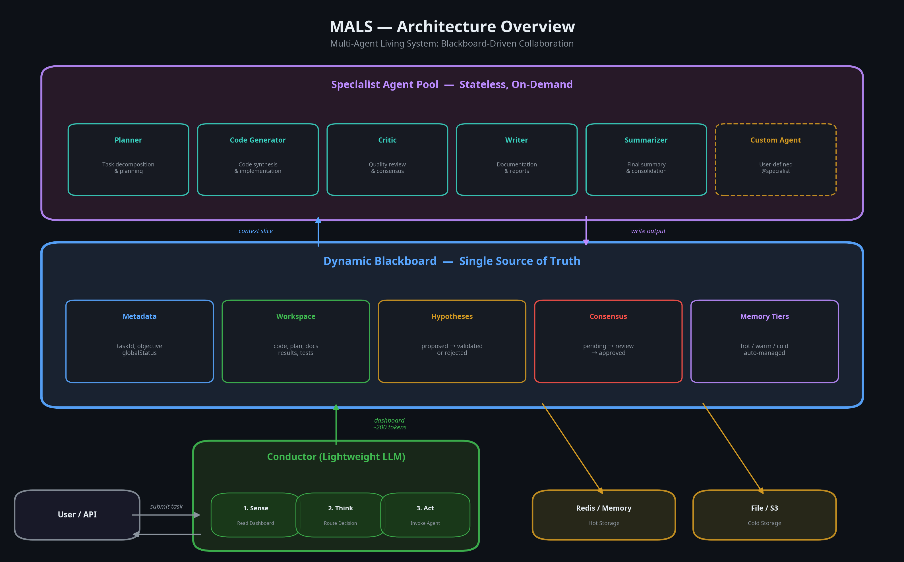
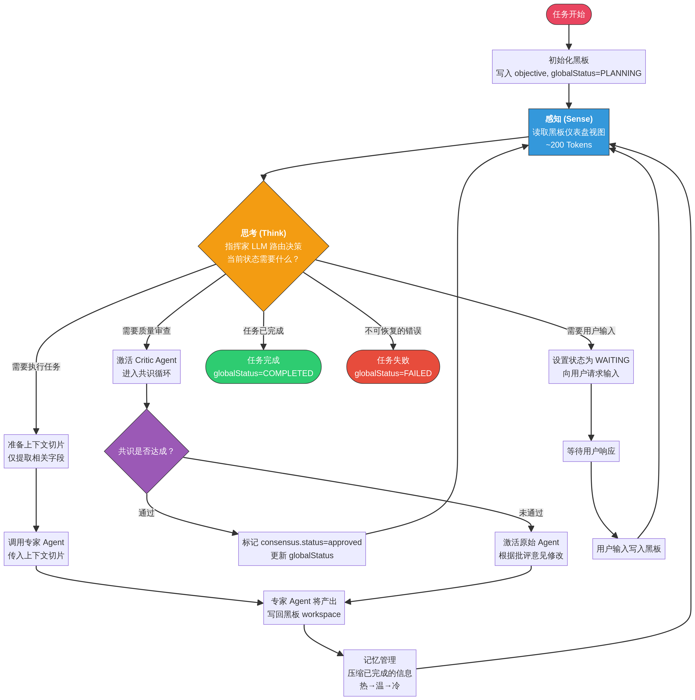
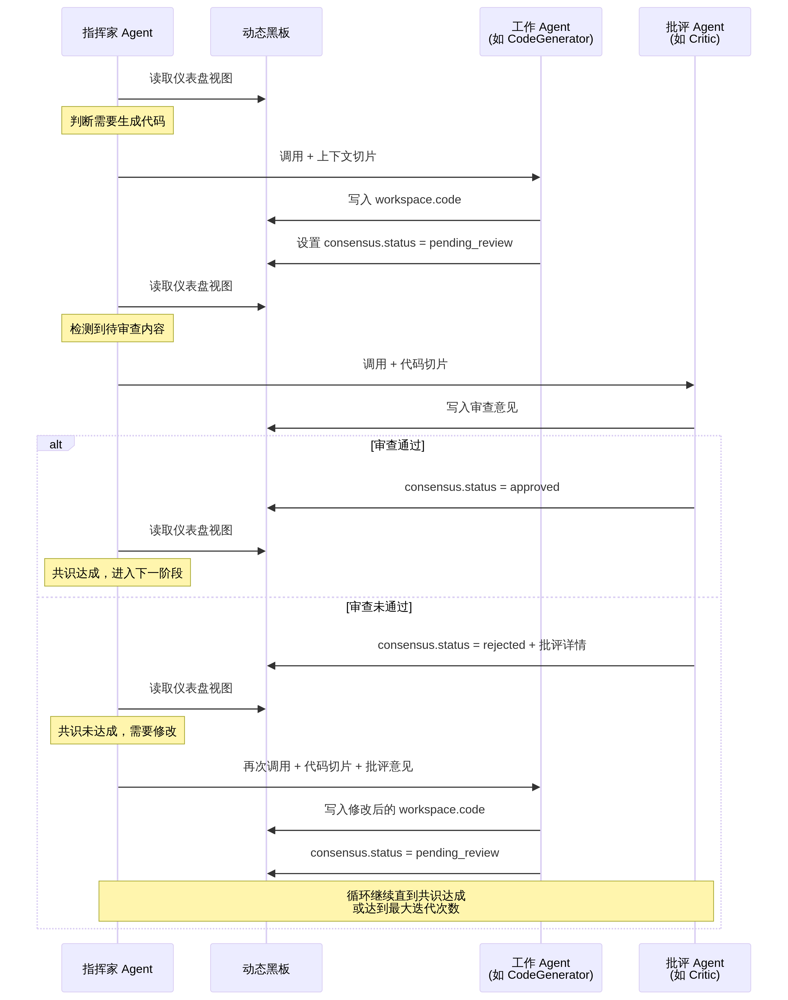
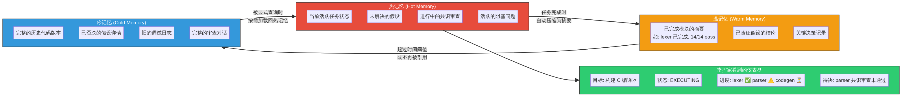

# MALS — Multi-Agent Living System

[中文](./README_CN.md) | [English](./README.md)

[](https://badge.fury.io/py/mals)
[](https://opensource.org/licenses/MIT)
[](https://www.python.org/downloads/release/python-3110/)

**MALS (Multi-Agent Living System)** is a multi-agent collaboration framework based on the **Blackboard Architecture**. It replaces fragile, chaotic direct agent communication with a shared, persistent, and self-organizing cognitive space.

## Core Philosophy: Escaping the Tribal Dilemma

Most current multi-agent systems (e.g., AutoGen, CrewAI) rely on a "conversation-driven" collaboration model, where agents use peer-to-peer messaging to advance tasks. This model quickly degenerates into a "tribal dilemma" when tasks become complex:

- **Context Loss**: Each agent tries to maintain an understanding of the global state within its limited context, leading to information distortion and forgetting during transmission.
- **Massive Communication Overhead**: As the number of agents increases, communication paths grow exponentially, and a significant amount of tokens are wasted on synchronizing state and repetitive communication.
- **Error Amplification**: A minor error or hallucination from one agent can quickly contaminate the entire system through the conversation chain, causing the collective to go off track.

**The core philosophy of MALS is: Agents should not talk to each other directly.**

Instead, all collaboration revolves around a centralized, structured **Dynamic Blackboard**. Agents act like craftsmen, taking tasks and raw materials from the blackboard, completing their part, and then placing their output back on the blackboard for other agents to use. This model fundamentally solves the tribal dilemma.

## Architecture Overview



MALS consists of four core components:

1.  **Dynamic Blackboard**: The system's Single Source of Truth. It is a structured data store (in-memory or Redis) that contains the task objective, workspace, hypotheses, consensus state, and memory. All agent inputs come from the blackboard, and all outputs are written back to it.

2.  **Conductor**: The system's "central nervous system." It is a lightweight scheduling agent that continuously executes a "Sense-Think-Act" loop with minimal token consumption:
    - **Sense**: Reads a highly compressed "dashboard" view of the blackboard.
    - **Think**: Decides which specialist agent to activate next.
    - **Act**: Invokes the chosen agent and provides it with the minimal context slice required to complete its task.

3.  **Specialist Agents**: Domain experts responsible for executing specific tasks (e.g., `code_generator`, `critic`, `planner`). Each specialist follows the Single Responsibility Principle, doing only what it does best.

4.  **Memory Manager**: Responsible for maintaining the blackboard's "cognitive load." It uses a three-tier memory model (hot-warm-cold) to automatically compress completed work into summaries and archive stale information, ensuring that the context windows of the Conductor and specialist agents remain lean.

## Key Features

- **Blackboard-Driven**: Completely replaces peer-to-peer communication, fundamentally reducing system complexity and token consumption.
- **Consensus Loop**: Ensures output quality and effectively suppresses hallucinations through a "write-critique-revise" cycle (e.g., `code_generator` writes code, `critic` reviews it).
- **Three-Tier Memory Management**: An automated memory decay mechanism allows the system to handle long, complex tasks without being limited by context windows.
- **Context Slicer**: The Conductor dynamically slices the minimal context required for a task from the blackboard when invoking a specialist, greatly improving efficiency.
- **Pluggable Agents**: Define your own specialist agents with a simple `@specialist` decorator to easily extend the system's capabilities.
- **Out-of-the-Box**: Comes with a set of core specialist agents, allowing you to run a complete multi-agent collaboration task with a single command.

## Quick Start

### 1. Installation

```bash
pip install mals
```

### 2. Set API Key

```bash
export OPENAI_API_KEY="sk-..."
```

MALS supports any OpenAI-compatible API. You can specify a custom endpoint (e.g., local models, Azure) via the `OPENAI_BASE_URL` environment variable.

### 3. Run Your First Task

```bash
mals run "Write a Python function that implements binary search. Include docstrings and tests."
```

The system will start, the Conductor will first invoke the `planner` to create a plan, then the `code_generator` to write the code, the `critic` to review it, and finally the `test_generator` to create test cases, all automatically.

## Usage

### Command Line

```bash
# Use a different model
mals run "Create a FastAPI endpoint for user login" --model gpt-4.1-mini

# Add constraints
mals run "Design a database schema for a blog" -k "Use PostgreSQL syntax" -k "Include user, post, and comment tables"

# Save results to a file
mals run "Summarize the latest news about AI" -o results.json
```

### Python API

You can also use MALS directly in your Python code:

```python
import asyncio
from mals import MALSEngine

async def main():
    engine = MALSEngine()
    result = await engine.run(
        objective="Write a Python script to fetch and parse RSS feeds.",
        constraints=["Use the 'feedparser' library"]
    )
    print(result["workspace"]["code"])

if __name__ == "__main__":
    asyncio.run(main())
```

## Architecture in Depth

### Conductor Loop



### Consensus Loop



### Memory Tiers



## Contributing

We welcome contributions of all kinds! Please see `CONTRIBUTING.md` for details.

## Roadmap

- **v0.2**: Visual dashboard and task replay
- **v0.3**: Specialist agent plugin marketplace
- **v0.4**: Cross-task memory and knowledge graph integration
- **v0.5**: Distributed deployment and fault tolerance

## Other notes
This is my first open-source project. I still have a lot to learn, so I really appreciate your support and look forward to growing together with you.
By the way, I’m building a more interesting platform. Hope you’ll keep following, leave me comments, and send email to me: imnotfcrobot@gmail.com.
Especially welcome friends working on biomedical & healthcare-related models, agents, and skill development!

## License

This project is licensed under the MIT License.
