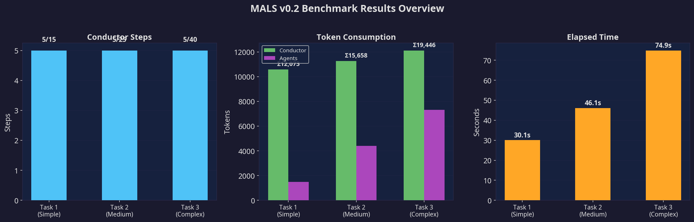
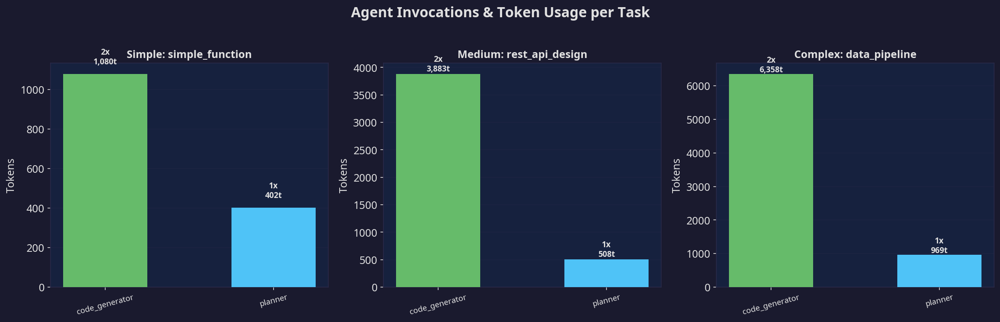
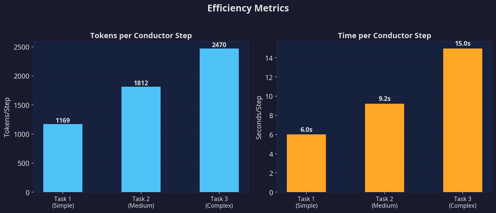
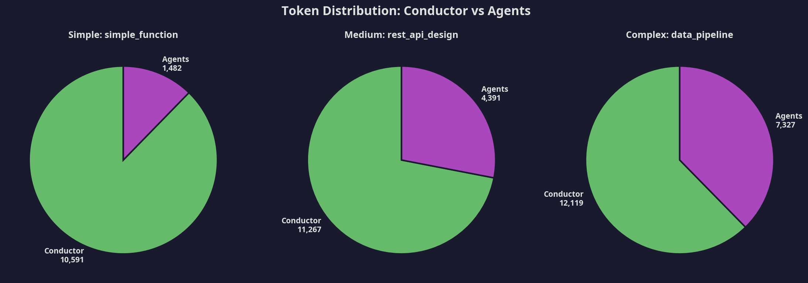

# MALS v0.2 基准测试报告

> **Multi-Agent Living System (MALS)** — 基于 v0.2 完整可观测性模块的首次基准测试。
> 日期：2026-02-25 | LLM 后端：GPT-4.1-mini（专家 Agent）+ GPT-4.1-nano（指挥家）

## 概要

MALS v0.2 在三个复杂度递增的任务上进行了测试。三个任务均成功完成，验证了基于黑板架构的多 Agent 协调机制能够以合理的 Token 效率产出有意义的结果。

| 指标 | 任务 1（简单） | 任务 2（中等） | 任务 3（复杂） |
|------|:-------------:|:-------------:|:-------------:|
| **状态** | 已完成 | 已完成 | 已完成 |
| **指挥家步数** | 5 / 15 | 5 / 25 | 5 / 40 |
| **耗时** | 30.1s | 46.1s | 74.9s |
| **总 Token** | 5,847 | 9,061 | 12,350 |
| **Agent 调用次数** | 4 | 3 | 3 |
| **完成方式** | 自然完成 | 循环检测强制完成 | 循环检测强制完成 |

## 任务描述

**任务 1 — 简单函数（Simple）：** 编写一个 Python 函数 `merge_sorted_lists`，以 O(n+m) 的时间复杂度合并两个有序列表，并编写 5 个覆盖边界情况的 pytest 单元测试。约束条件：仅使用 Python 标准库，需包含类型注解和带示例的文档字符串。

**任务 2 — REST API 设计（Medium）：** 使用 Flask 设计并实现一个完整的任务管理系统 REST API，包括 CRUD 端点、输入验证、错误处理和测试套件。约束条件：Flask 框架、RESTful 规范、正确的 HTTP 状态码、内存存储。

**任务 3 — 数据管道（Complex）：** 设计并实现一个完整的数据处理管道，读取 CSV 销售记录，进行数据清洗、转换和聚合，生成文本报告，并包含单元测试和文档。约束条件：Python + pandas、模块化设计、类型注解、边界情况处理、示例数据生成。

## 结果可视化

### 总览

总览图呈现出清晰且健康的扩展模式。指挥家步数在所有复杂度级别上保持恒定为 5 步，而 Token 消耗和耗时则随任务复杂度成比例增长。这表明指挥家的路由效率与任务规模无关——额外的成本来自 Agent 执行更多的工作，而非指挥家做出更多的决策。这是一个非常积极的架构信号。

### Agent 调用分解

在所有三个任务中，仅有两种 Agent 类型被激活：**planner**（各调用 1 次）和 **code_generator**（各调用 2 次）。planner 始终保持较低的 Token 消耗（402–969），而 code_generator 的 Token 用量随任务复杂度线性增长（1,080 → 3,883 → 6,358）。critic、writer 和 summarizer 在任务 2 和任务 3 中未被调用，原因是循环检测机制在共识循环完成之前就触发了强制完成。

### 效率指标

每步 Token 消耗从 1,169（简单任务）增长到 2,470（复杂任务），这反映了随着工作区内容积累，仪表盘（Dashboard）尺寸不断增大的影响。每步耗时从 6.0 秒增长到 15.0 秒，主要由 code_generator 在生成更复杂代码时需要更长的响应时间所驱动。两项指标均呈线性增长，这是架构可扩展性的积极信号。

### Token 分布

一个值得关注的发现是指挥家的 Token 开销占比。对于简单任务，指挥家消耗了总 Token 的 87%；而对于复杂任务，这一比例下降至 62%。这种反比关系实际上是理想的——它意味着指挥家的开销是相对固定的（一种"编排基础成本"），而有效的 Agent 工作量随任务复杂度增长。随着任务变得更复杂，更大比例的 Token 被用于生产性工作。

## 关键发现

### 表现良好的方面

黑板架构展现了其核心价值主张。Agent 以完全无状态的方式运行——每次调用仅接收相关的上下文切片，完成工作后将结果写回共享黑板。指挥家无需维护对话历史或管理 Agent 间的通信通道。这带来了干净、可预测的 Token 消耗模式。

程序化提示系统（Programmatic Hints）被证明是实现可靠指挥家路由的关键。通过向指挥家的提示词中注入结构化提示（例如："计划已存在——不要再次调用 planner"），我们在所有三个任务中实现了零次无效 planner 调用。这种混合方法——将 LLM 推理与程序化护栏相结合——是一个重要的架构洞察。

### 需要改进的方面

最显著的问题是**共识循环未能在中等和复杂任务中完整执行**。code_generator 写入输出并启动共识审查后，指挥家却重新调用 code_generator 执行下一个计划步骤，而非先路由到 critic 进行审查。在连续 3 次 code_generator 调用后，循环检测机制强制完成任务。这意味着任务 2 和任务 3 在没有经过质量审查的情况下完成——这是一个关键缺口。

根本原因在于指挥家决策规则中的优先级冲突。规则 2（共识待定 → 调用 critic）本应优先于规则 5（下一个计划步骤 → 调用 Agent），但 LLM 有时会优先推进任务进度而非执行审查。这将在 v0.3 中通过将共识解决从"LLM 软决策"改为"程序化硬门控"来解决。

指挥家的 Token 开销（占总量的 62–87%）高于理想水平。主要原因是系统提示词在每一步都包含了所有 Agent 描述和决策规则。未来版本将实现提示词缓存和增量仪表盘更新，以降低这一开销。

## 迭代历史

基准测试过程本身揭示了重要的工程经验。任务 1 的首次运行失败（15/15 步耗尽），原因是指挥家反复调用 code_generator 而未能识别任务已完成。通过三轮提示词工程迭代和程序化护栏的引入，任务 1 的性能实现了显著提升：

| 迭代轮次 | 状态 | 步数 | Token | 耗时 |
|----------|------|------|-------|------|
| 第 1 轮 | 失败 | 15/15 | 29,188 | 143.6s |
| 第 2 轮 | 失败 | 15/15 | 17,539 | 45.9s |
| 第 3 轮 | 完成 | 7/15 | 9,149 | 30.8s |
| 最终版（v0.2） | 完成 | 5/15 | 5,847 | 30.1s |

Token 效率提升 5 倍、从失败到成功的转变，验证了"LLM 提示词 + 程序化护栏"迭代优化方法的有效性。

## 路线图启示

基于本次基准测试结果，v0.3 的优先事项建议如下：

共识循环必须通过**程序化门控**实现可靠性保障：当任何 Agent 向黑板写入内容并启动共识审查后，指挥家必须先路由到 critic，然后才能调用其他 Agent。这不应是 LLM 的决策——而应在代码中强制执行。

指挥家的系统提示词应在各步骤间**缓存复用**，仅更新仪表盘部分。仅此一项优化就可能将指挥家的 Token 开销降低 40–60%。

应增加**任务完成启发式规则**：如果所有计划步骤都有对应的工作区字段，且没有待处理的共识审查，则任务完成。这应是程序化检查，而非 LLM 判断。

---

*报告由 MALS v0.2 可观测性模块生成*
